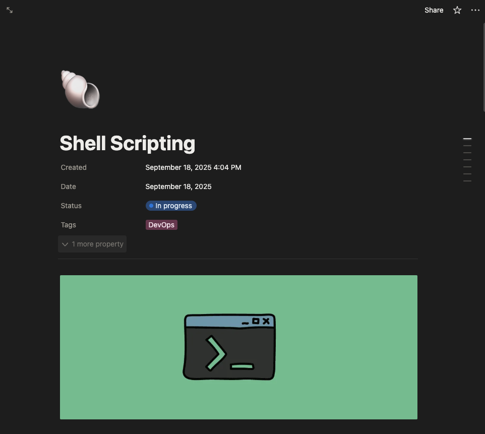

# Lucas Guerra Linux Study

This repository is designed to be the place where I'll upload all my Linux-related studies. Here you will find materials, notes, and code examples covering topics such as:

- Bash scripting
- File permissions
- Linux commands and utilities
- Shell customization
- Process management

## Documentation

In addition to this repository, I've created a Notion page to document and organize my studies.

Feel free to explore!
